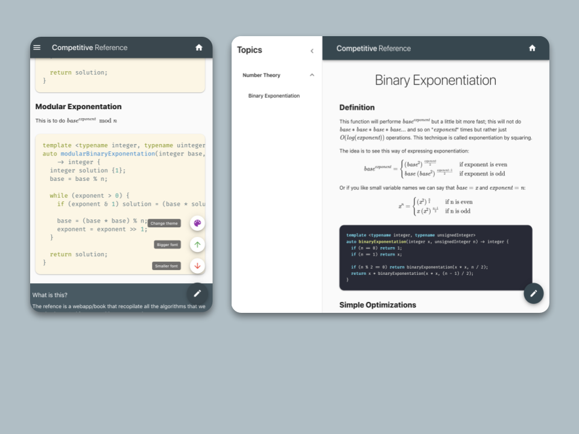
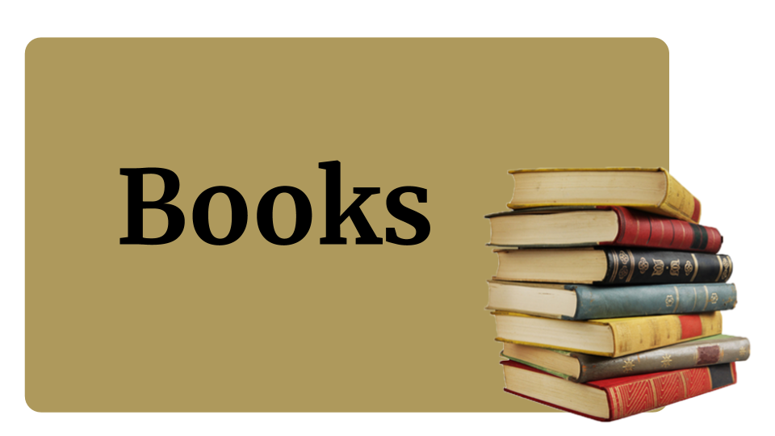

#  Competitive Programming Reference

## What is this?

The refence is a webapp/book that recopilate all the algorithms that we have
implemented for competitive programming.

## Where is the code?

You can find all the raw code implementations in this link

## Components

### Webpage

We have develop an interactive webpage where you can see a quick explanation of many
of the algorithms presented here and snippets of the implementation per se:

### Books: Intro to Competitive programming

We also are writing a book in spanish about the topic.

Así que si sabes español, y quieres entrar a este mundo, ve este libro e introducete en C++
y los principales algoritmos de programacioón competitiva.

### Books: Reference

Finally, we are developing a new refence for contest like ICPC to check at a glance all
the algorithms we have implemented.

